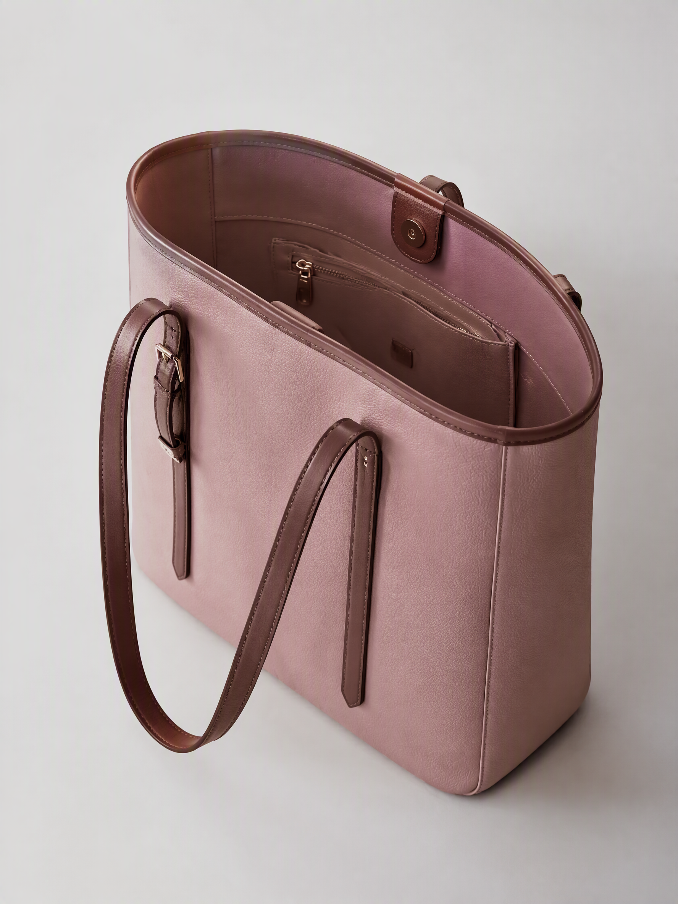
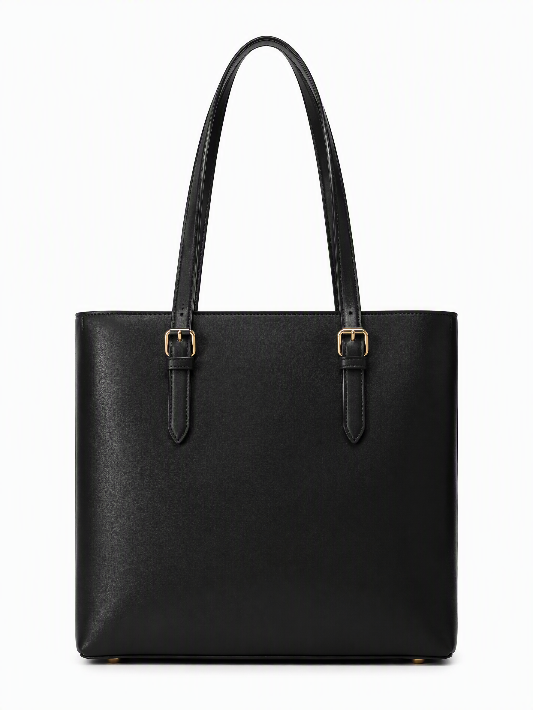
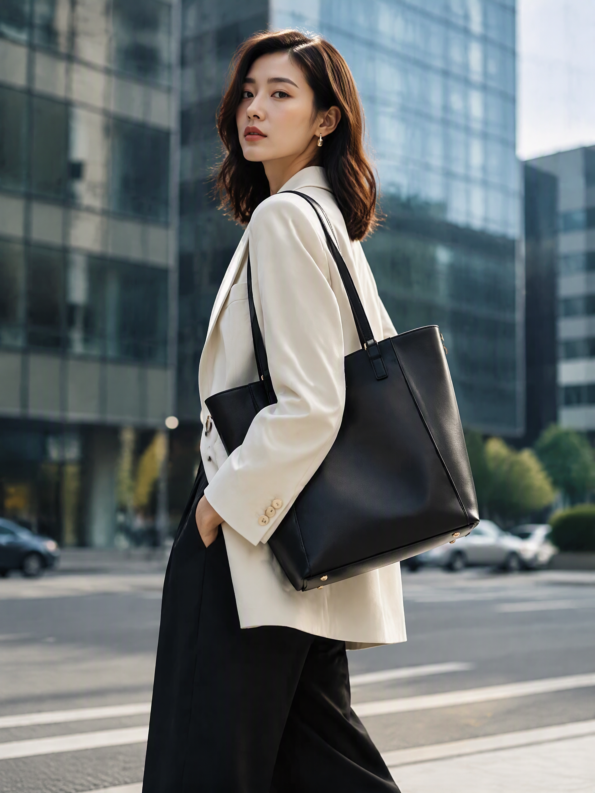
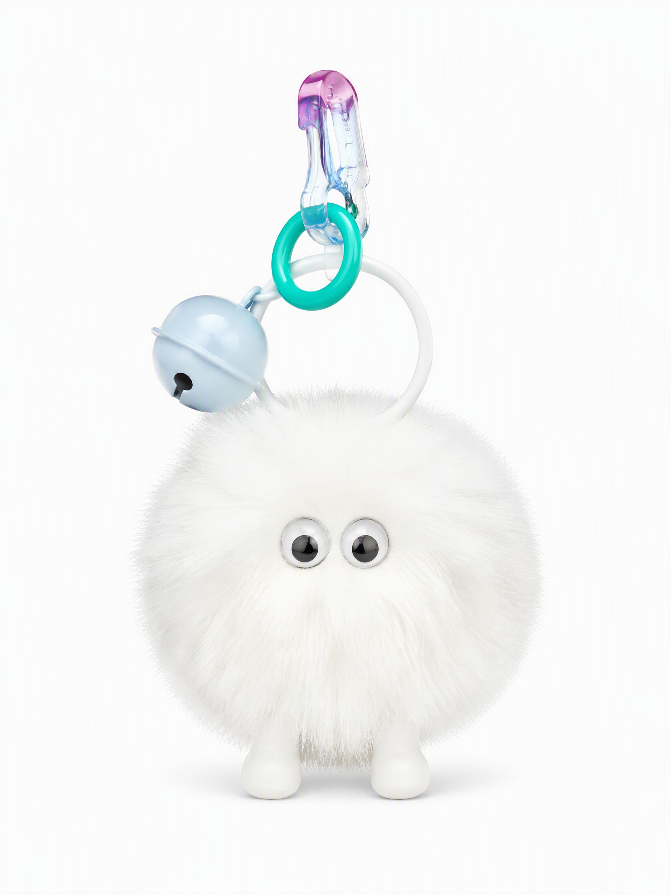
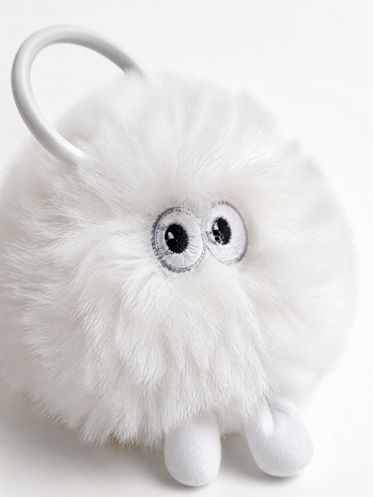
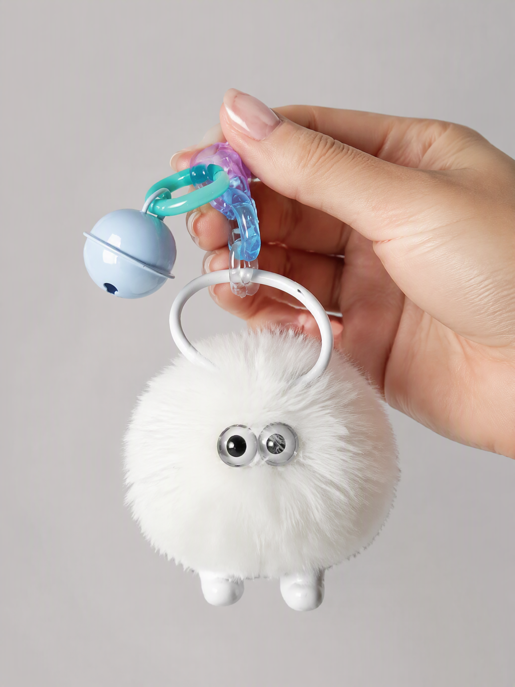

# AI 箱包概念图展示

**白沟箱包 × AI 出图 —— 从概念到电商套图**

> 作者：林舟 | 白沟边上做 AI 落地的
> 所有图片由 AI 生成，用于展示 AI 在箱包电商设计中的应用能力。

---

## 一、托特包系列（Tote Bag）

### 概念设计

粉色托特包 45 度概念图 —— 展示 AI 从零到一的设计能力。

### 标准电商套图

黑色托特包正面主图，纯白背景，适合直接上架。

通勤场景展示 —— 从"产品图"到"场景图"，AI 帮你讲使用故事。

---

## 二、包挂件系列（Bag Charm）

### 标准电商套图

白色毛绒挂件主图，纯白精修，白底图直接可用。

材质特写 —— 绒毛、眼睛、挂扣，细节经得起放大看。

手持展示 —— 真实感营造，让用户"觉得能摸到"。

---

## 三、AI 出图 vs 传统拍摄对比

| 项目 | 传统拍摄 | AI 出图 |
|------|---------|---------|
| 周期 | 3-5 天 | 3-5 分钟 |
| 成本 | 200-500 元/套 | 不到 1 元/张 |
| 场景 | 受限于场地 | 任何场景随时换 |
| 修改 | 重拍 | 改提示词重出 |
| 数量 | 1 套/天 |  unlimited |

---

## 四、我能帮你做什么

**AI 出图服务 —— 箱包/配饰/小商品**

1. **概念图**：还没打样？先出图看效果
2. **标准套图**：主图+详情+场景，直接上架
3. **差异化版本**：换色、换材质、换背景，A/B 测试用

**适用平台：**
- 抖音小店
- 淘宝/拼多多
- 小红书种草
- 闲鱼展示

---

## 五、使用说明

本仓库图片遵循 **CC BY-NC 4.0**（署名-非商业性使用）协议。

- ✅ 学习参考
- ✅ 转发分享（注明来源）
- ✅ 作为案例展示给商家看
- ❌ 直接商用（需联系授权）

---

## 六、联系我

如果你在白沟做箱包，或者需要 AI 出图服务，可以找我聊聊。

> 不接摄影棚的活，专接"等不起、拍不起、想先试试"的活。

---

*2026-09 更新 | 持续添加新案例*
